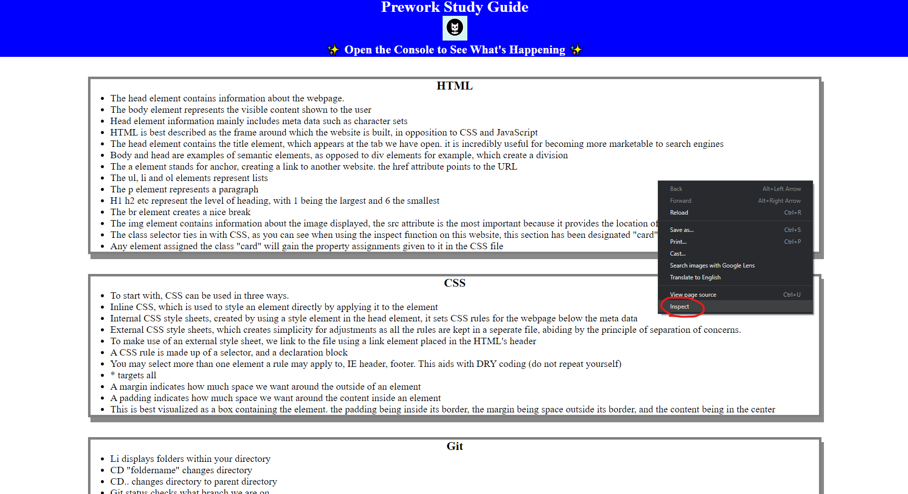
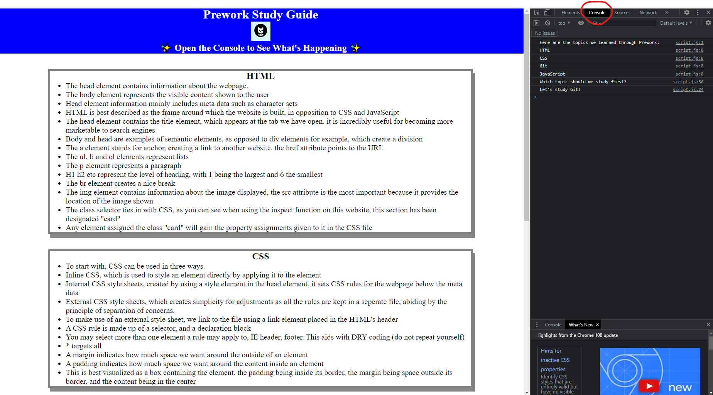

# prework-study-guide
## A summary on what Prework taught me.

In the process of creating this website, I've had to acquire a few new skills, and this guide shall help if I ever need to revisit the lessons. If you are reading this as someone who is looking at an example of what it could look like when you finish yours, feel free to email me with feedback, I'd love to hear from you @blastech1@outlook.com

## Table of Contents

- [Usage](## Usage)
- [Credits](## Credits)
- [License](## License)

## Usage

Open the website, read the allotted sections on what you want to learn. Make sure to use the inspect function to see what JavaScripts console.log has to say!

```md

```

```md

```

## Credits

- Github has been extremely helpful gathering this information, as has [Mozilla](https://developer.mozilla.org/en-US/docs/Learn) and [W3schools](https://www.w3schools.com/default.asp)

## License
This project has been licensed under the MIT license

